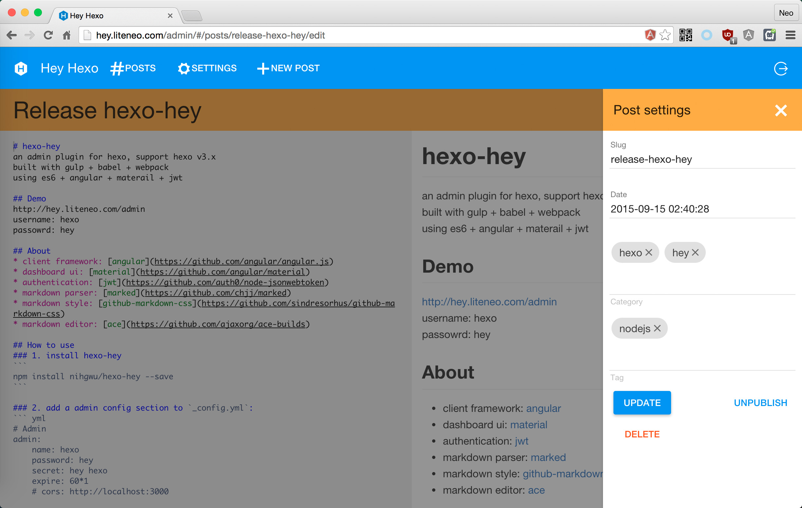
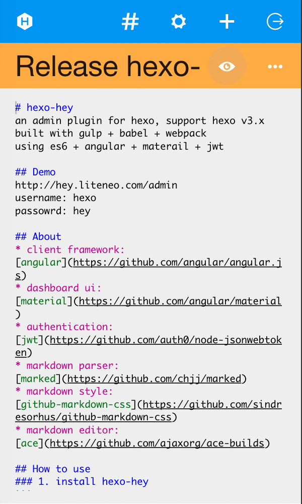

# hexo-hey
an admin plugin for hexo, support hexo v3.x  
built with gulp + babel + webpack  
using es6 + angular + materail + jwt

## Demo
[http://nihgwu.github.io/hexo-hey/](http://nihgwu.github.io/hexo-hey/)  
username: hexo  
passowrd: hey  

## Screenshots



## About
* client framework: [angular](https://github.com/angular/angular.js)
* dashboard ui: [material](https://github.com/angular/material)
* authentication: [jwt](https://github.com/auth0/node-jsonwebtoken)
* markdown parser: [marked](https://github.com/chjj/marked)
* markdown style: [github-markdown-css](https://github.com/sindresorhus/github-markdown-css)
* markdown editor: [codemirror](https://github.com/codemirror/CodeMirror)

## Usage
### 1. install hexo-hey
```
npm install hexo-hey --save
```

### 2. add a admin config section to `_config.yml`:
``` yml
# Admin
admin:
    name: hexo
    password: hey
    secret: hey hexo
    expire: 60*1
    # cors: http://localhost:3000
```
cors is optional if you want serve your client in another place(CDN for example)

### 3. serve hexo
```
hexo serve
```
then visit `http://localhost:4000/admin` , and login with the account set in previous step
